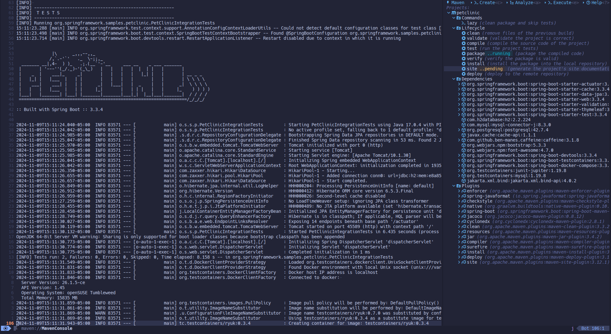

<br/>
<div align="center">
  <a  href="https://github.com/oclay1st/maven.nvim">
    
  </a>
</div>

**maven.nvim** is a Maven plugin for Neovim.

<div>
  
</div>

## 🔥 Status
This plugin is under **development** and has some known issues, so it is not considered stable enough.

## ✨ Features

- Execute lifecycle goals, plugins goals and custom commands
- List dependencies and their relationship
- Analyze dependencies usages, conflicts and duplications
- Enqueue multiple goal executions
- Show the output of the commands executions

## ⚡️ Requirements

-  Luarocks (install Lua headers)
-  For Unix systems:
   - `unzip`
-  For Windows systems:
   - `GNU tar`

## 📦 Installation

### lazy.nvim

```lua
{
   "oclay1st/maven.nvim",
   cmd = 'Maven',
   dependencies = {
      "nvim-lua/plenary.nvim",
      "MunifTanjim/nui.nvim",
      { "oclay1st/xml2lua", build = "rockspec" },
   },
   config = function()
     require("maven").setup({
      -- options, see default configuration
    })
   end
}
```

## ⚙️  Default configuration

```lua
{
  projects_view = {
    position = 'right',
    size = 68,
  },
  console = {
    show_command_execution = true,
    show_lifecycle_execution = true,
    show_plugin_goal_execution = true,
    show_dependencies_load_execution = false,
    show_plugins_load_execution = false,
  },
  mvn_executable = 'mvn',
  custom_commands = {
    -- Example: 
    -- {
    --   name = "lazy",
    --   cmd_args = { "clean", "package", "-DskipTests" },
    --   description = "clean package and skip tests",
    -- }
  }, 
}
```
